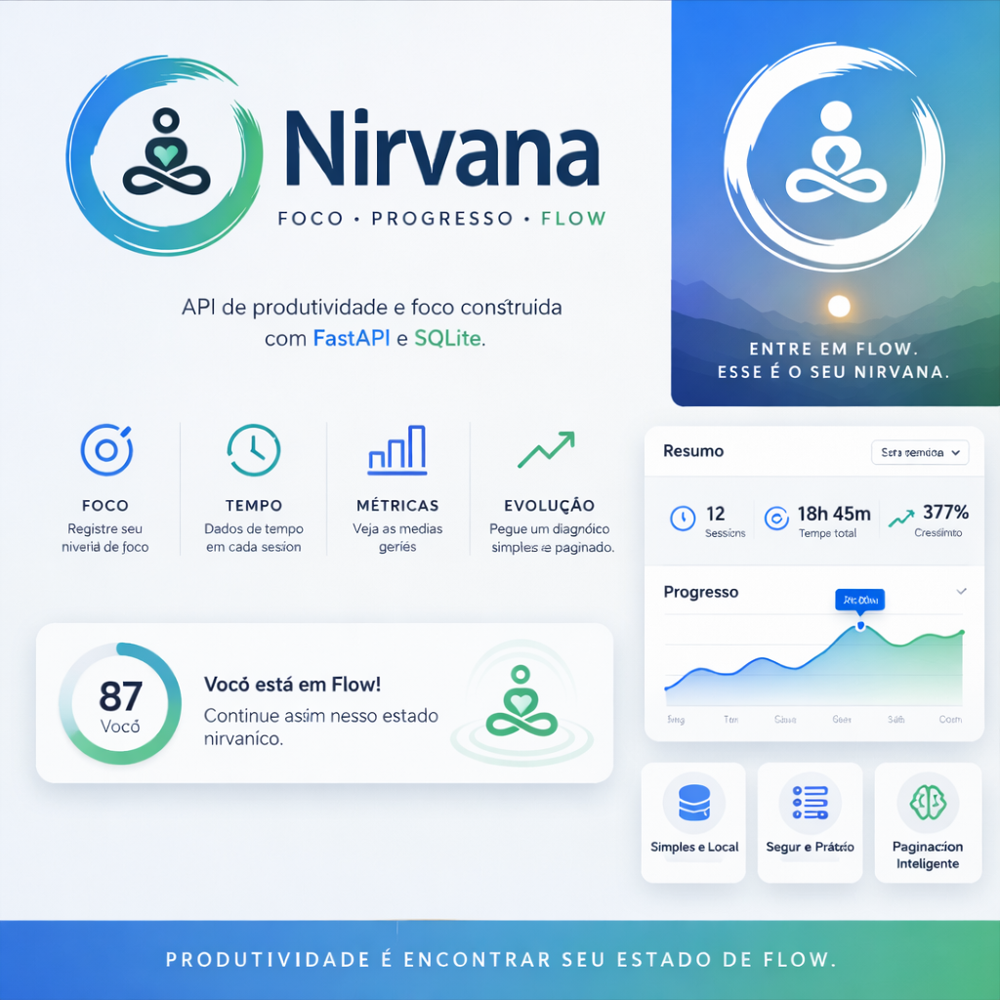
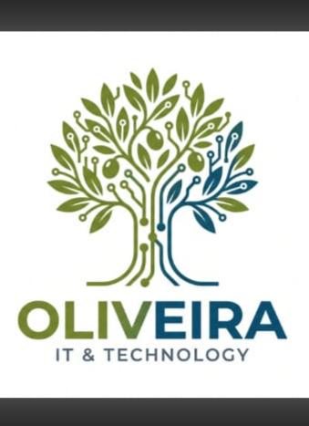

<p align="center">
  
</p>

# Nirvana

Como passamos pelo desafio de entender nosso aprendizado — estamos sendo eficazes? Faz sentido todas essas horas de dedicação?  
Partindo desse questionamento, apresentamos a ferramenta **Nirvana**, criada para verificar se o seu fluxo de aprendizado está sendo favorável ao seu estilo de vida e evolução pessoal.  

Na versão **Alfa**, disponibilizaremos apenas o módulo de verificação do fluxo de aprendizado: [ww.flownirvana](https://ww.flownirvana)


## Funcionalidades

- Registro de foco com nivel, tempo, comentario, categoria e tags.
- Listagem de registros com paginacao.
- Diagnostico de produtividade com media de foco, tempo total e distribuicao.
- Persistencia local em SQLite (`nirvana.db`).

## Tecnologias

- Python
- FastAPI
- Pydantic
- SQLite
- Uvicorn
- Pytest

## Estrutura

```text
app/
  database/
    storage.py
  models/
    registro.py
  routes/
    diagnostico.py
    focus.py
  services/
    diagnostico_service.py
    focus_service.py
  main.py
tests/
requirements.txt
```

## Como executar

Crie e ative um ambiente virtual:

```bash
python -m venv .venv
```

No Windows PowerShell:

```powershell
.\.venv\Scripts\Activate.ps1
```

Instale as dependencias:

```bash
pip install -r requirements.txt
```

Inicie a API:

```bash
uvicorn app.main:app --reload
```

A documentacao interativa fica disponivel em:

```text
http://127.0.0.1:8000/docs
```

## Endpoints

### Registrar foco

`POST /registrar-foco`

Exemplo de corpo:

```json
{
  "nivel_foco": 8,
  "tempo_minutos": 45,
  "comentarios": "Sessao de estudo produtiva",
  "categoria": "estudo",
  "tags": ["python", "api"]
}
```

### Listar registros

`GET /registros?pagina=1&tamanho=10`

Parametros:

- `pagina`: numero da pagina, iniciando em 1.
- `tamanho`: quantidade de registros por pagina, entre 1 e 50.

### Diagnostico de produtividade

`GET /diagnostico-produtividade`

Retorna total de registros, media de foco, tempo total em minutos, mensagem de feedback e distribuicao dos niveis de foco.

## Observacao sobre a paginacao

A funcao principal de paginacao esta em `app/database/storage.py` com o nome `paginacao_registros`. Tambem existem aliases para `paginacao_registro` e `paginacao_registros_service`, evitando erro de importacao caso algum trecho antigo ainda use esses nomes.

## 🤖 IAs Utilizadas

- **Claude.ai** → Planejamento da arquitetura do projeto  
  *(conforme arquivo `Conversas_Arquitetura_Focus`)*

- **ChatGPT (Gepeto)** → Apoio na codificação *(conforme arquivo `Conversas_Arquitetura_Focus`)* 

- **Copilot** → Suporte para dúvidas e debugging
- 
- # Trabalho executado por oliveira,  para mais soluções entre em contato.
- <p align="center">
  
</p>

- 
